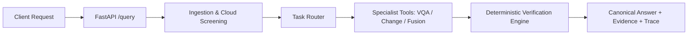

# SatQuery AI Backend

SatQuery AI is a multimodal Earth Observation (EO) intelligence backend that combines optical and Synthetic Aperture Radar (SAR) imagery to answer analytical geospatial queries with deterministic verification and auditable evidence traces.

## Core Capabilities & Query Modes

| Mode | Input Requirements | Description |
|---|---|---|
| **VQA** | 1 supported image | Visual Question Answering on satellite scenes |
| **CHANGE_VQA** | 2 Images (T1 & T2) | Bi-temporal change detection (e.g., building expansion, land use shifts) |
| **FUSION** | 1 Optical + 1 SAR image | Cross-modal analysis resolving optical cloud cover with SAR radar backscatter |



## Quickstart

### Prerequisites
- Python 3.10+
- [uv](https://docs.astral.sh/uv/) package manager

### 1. Installation
```bash
git clone <repo-url>
cd bck
uv sync
```

### 2. Start the API Server
```bash
uv run uvicorn app.api.main:app --host 0.0.0.0 --port 8000
```
Interactive API documentation is available at `http://localhost:8000/docs`.

## Demo Usage

### 1. Single-Image VQA
```bash
curl -X POST http://localhost:8000/query \
  -F "query=What features are present in this satellite scene?" \
  -F "images=@tests/fixtures/levir_test_1_t1.png;type=image/png" \
  -F "modality=optical"
```

### 2. Bi-Temporal Change Detection
```bash
curl -X POST http://localhost:8000/query \
  -F "query=Identify building changes between time 1 and time 2" \
  -F "images=@tests/fixtures/levir_test_1_t1.png;type=image/png" \
  -F "images=@tests/fixtures/levir_test_1_t2.png;type=image/png" \
  -F "modality=optical" \
  -F "modality=optical"
```
*Note: Uses the BIT LEVIR transformer model if the checkpoint is present; otherwise falls back to a lightweight deterministic image-difference heuristic.*

### 3. Optical + SAR Cross-Modal Fusion
```bash
curl -X POST http://localhost:8000/query \
  -F "query=Detect water bodies and evaluate flood extent" \
  -F "images=@tests/fixtures/Bolivia_103757_S2Hand.tif;type=image/tiff" \
  -F "images=@tests/fixtures/Bolivia_103757_S1Hand.tif;type=image/tiff" \
  -F "modality=optical" \
  -F "modality=sar"
```
*Note: When optical imagery is degraded by cloud cover, a `DegradationNotice` is attached with a recommendation for SAR fallback. SAR microwave surface water observations are preserved to provide flood intelligence.*

## Evidence Export Endpoints

The backend provides evidence export routes accepting the JSON output of `/query`:

- **Export PDF Report**: `POST /api/evidence/export-pdf`
  Returns a structured PDF evidence brief (`application/pdf`).
- **Export GeoJSON**: `POST /api/evidence/export-geojson`
  Returns detected geospatial vector features as GeoJSON (`application/geo+json`).

```bash
# Example: Export PDF brief from query response JSON
curl -X POST http://localhost:8000/api/evidence/export-pdf \
  -H "Content-Type: application/json" \
  -d @answer.json \
  --output evidence-report.pdf
```

## Configuration & Environment Variables

| Variable | Default | Description |
|---|---|---|
| `SATQUERY_CLOUD_DEGRADATION_THRESHOLD` | `0.20` | Cloud fraction threshold (0.0-1.0) above which optical degradation notice is issued |
| `SATQUERY_BIT_CHECKPOINT_PATH` | `checkpoints/BIT_LEVIR/best_ckpt.pt` | Local path to weights for the BIT change detection model |

*Note: For VQA, local InternVL2-2B weights (`OpenGVLab/InternVL2-2B`) load via Hugging Face cache on GPU/CPU. When running without local model checkpoints in testing environments, lightweight adapters can be supplied.*

## Architecture & Deterministic Verification

SatQuery AI employs a strict verification engine enforcing:
- **Evidence Gate**: Rejects ungrounded narrative claims without supporting raster/feature observations.
- **Confidence Floor**: Filters low-confidence detections and triggers explicit typed abstention if evidence falls below policy thresholds.
- **Sensor Physical Compatibility**: Rejects physical impossibilities (e.g., optical spectral reflectance queries evaluated against SAR microwave backscatter).
- **Cross-Modal Reconciliation**: Surfaces optical cloud limitations transparently while preserving SAR radar penetrations.
- **Structured Audit Trace**: Every execution produces an end-to-end trace recording stage timings, asset hashes, and verification steps.

## Validation & Tests

Run the backend test suites:
```bash
# F22 cloud degradation & SAR fallback tests
uv run pytest tests/pipeline/test_degradation_fallback.py -v

# Multimodal pipeline tests (VQA, Change Detection, Fusion)
uv run pytest tests/pipeline/test_multimodal_pipeline.py -v

# FastAPI multipart API endpoint tests
uv run pytest tests/api/test_main.py -v

# Code quality & import architecture checks
uv run ruff check app tests
uv run lint-imports
```
